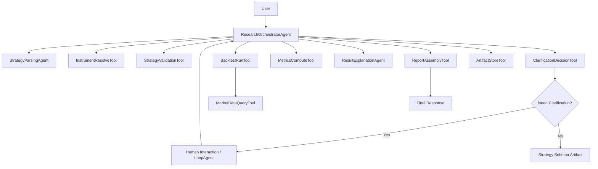

# ADK Agent 拓扑 V1

## 1. 文档目标

这份文档用于定义第一版系统在 Google ADK 中的 Agent / Tool 拓扑结构。

它回答的问题是：

- 第一版到底有哪些 Agent
- 每个 Agent 负责什么
- 每个 Agent 可以调用哪些 Tool
- 主链路如何在这些对象之间流转
- 哪些节点适合用 Sequential、Loop、Sub-agent 来表达

这份文档是在 [ADK 系统架构 V1](docs/adk_system_architecture_v1.md) 基础上的进一步细化。

## 2. 第一版拓扑设计目标

第一版拓扑设计需要同时满足 5 个目标：

1. 主链路清晰
2. 职责边界稳定
3. 便于逐步实现
4. 便于后续扩展
5. 充分利用 ADK，而不过度复杂化

## 3. 第一版总体拓扑

第一版建议采用：

- `1` 个顶层编排 Agent
- `2` 个核心子 Agent
- `1` 个可预留的后续研究子 Agent
- `6-8` 个确定性 Tool

也就是说，第一版不是极简单 Agent，也不是复杂网状多 Agent。

我们采用：

- 顶层集中编排
- 子 Agent 分工明确
- Tool 负责确定性执行

## 4. 拓扑总览

建议的核心对象如下：

### 顶层 Agent

- `ResearchOrchestratorAgent`

### 核心子 Agent

- `StrategyParsingAgent`
- `ResultExplanationAgent`

### 预留子 Agent

- `ResearchFollowUpAgent`

### 核心 Tool

- `InstrumentResolveTool`
- `StrategyValidationTool`
- `ClarificationDecisionTool`
- `MarketDataQueryTool`
- `BacktestRunTool`
- `MetricsComputeTool`
- `ArtifactStoreTool`
- `ReportAssemblyTool`

## 5. 顶层 Agent 设计

## 5.1 `ResearchOrchestratorAgent`

这是第一版系统的总控 Agent。

### 核心职责

- 判断用户输入是否属于策略研究
- 决定是否进入澄清流程
- 调用策略解析子 Agent
- 触发回测与结果解释主流程
- 管理 Session State 更新
- 组织最终返回给用户的内容

### 它不应该负责什么

- 不直接进行指标计算
- 不直接执行回测
- 不直接读取底层 parquet 数据
- 不承担长篇结果解释细节

### 它的主要输入

- 用户问题
- 当前 Session State
- 当前 Session Memory

### 它的主要输出

- 澄清问题
- 策略卡
- 回测执行指令
- 最终结果响应

## 6. 子 Agent 设计

## 6.1 `StrategyParsingAgent`

### 职责

- 识别策略类型
- 把自然语言转换成结构化策略草案
- 抽取关键字段
- 标记疑似缺失项

### 典型输入

- 用户原始问题
- 如有必要，结合历史会话上下文

### 典型输出

- `strategy_draft`
- `problem_type`
- `candidate_defaults`
- `missing_fields`

### 为什么它应该是 Agent 而不是 Tool

因为这一步本质上是开放式语义理解和结构抽取，不是纯规则变换。

## 6.2 `ResultExplanationAgent`

### 职责

- 读取回测结果和指标
- 生成结论摘要
- 解释收益曲线
- 解释回撤和风险来源
- 输出局限性与风险提示

### 典型输入

- `strategy_schema`
- `backtest_result`
- `metrics`
- 收益曲线 / 回撤曲线数据

### 典型输出

- `summary_text`
- `risk_text`
- `stability_text`
- `limitations_text`

### 为什么它应该是 Agent

因为这一步需要将结构化结果翻译成高质量、面向用户的语言解释。

## 6.3 `ResearchFollowUpAgent`

### 当前状态

- 第一版预留，不一定立刻实现

### 预期职责

- 处理基于已有结果的追问
- 支持参数修改再回测
- 支持对比不同版本策略

### 为什么要预留

因为这个产品天然不是“一问一答即结束”，而是研究工作台。

## 7. Tool 层设计

## 7.1 `InstrumentResolveTool`

### 负责什么

- 将自然语言标的解析成标准代码

### 由谁调用

- `ResearchOrchestratorAgent`
- `StrategyParsingAgent`

### 返回什么

- 标准代码
- 候选列表
- 是否唯一匹配

## 7.2 `StrategyValidationTool`

### 负责什么

- 校验 `Strategy Schema V1`
- 检查字段完整性和合法性

### 由谁调用

- `ResearchOrchestratorAgent`

### 返回什么

- 缺失字段
- 非法字段
- 是否可执行

## 7.3 `ClarificationDecisionTool`

### 负责什么

- 根据 [澄清规则 V1](docs/clarification_rules_v1.md) 判断：
  - 哪些字段必须追问
  - 哪些字段可默认补全
  - 是否可以继续执行

### 由谁调用

- `ResearchOrchestratorAgent`

### 返回什么

- `must_ask_fields`
- `defaultable_fields`
- `ready_to_execute`

## 7.4 `MarketDataQueryTool`

### 负责什么

- 统一读取本地市场数据

### 由谁调用

- `BacktestRunTool`
- 必要时也可被解释层调用补充基准信息

### 返回什么

- 标准化价格数据
- 基准数据
- 截面数据

## 7.5 `BacktestRunTool`

### 负责什么

- 按回测假设执行策略

### 由谁调用

- `ResearchOrchestratorAgent`

### 返回什么

- 净值序列
- 交易记录
- 持仓记录
- 回测摘要

## 7.6 `MetricsComputeTool`

### 负责什么

- 从回测结果计算核心指标

### 由谁调用

- `ResearchOrchestratorAgent`
- 也可以由 `BacktestRunTool` 之后自动衔接

### 返回什么

- 年化收益
- 最大回撤
- 夏普比率
- 胜率
- 年度收益

## 7.7 `ArtifactStoreTool`

### 负责什么

- 保存中间和最终产物到 ADK Artifact 层

### 由谁调用

- `ResearchOrchestratorAgent`
- 回测完成后可由回调触发

### 典型保存对象

- 策略卡
- Strategy Schema
- 回测结果
- 收益曲线图
- 报告

## 7.8 `ReportAssemblyTool`

### 负责什么

- 把策略卡、指标、图表数据和解释文本整合成前端结果对象

### 由谁调用

- `ResearchOrchestratorAgent`

## 8. 推荐调用关系

第一版建议调用关系如下：

```text
User
  -> ResearchOrchestratorAgent
      -> StrategyParsingAgent
      -> InstrumentResolveTool
      -> StrategyValidationTool
      -> ClarificationDecisionTool
      -> LoopAgent (if clarification needed)
      -> ArtifactStoreTool (store strategy draft / schema)
      -> BacktestRunTool
          -> MarketDataQueryTool
      -> MetricsComputeTool
      -> ArtifactStoreTool (store backtest result / equity curve)
      -> ResultExplanationAgent
      -> ReportAssemblyTool
  -> Final Response
```

## 9. 主链路拓扑

第一版主链路建议拆成 4 段。

## 9.1 研究理解段

对象：

- `ResearchOrchestratorAgent`
- `StrategyParsingAgent`
- `InstrumentResolveTool`

目标：

- 把用户问题转成策略草案

## 9.2 澄清收敛段

对象：

- `StrategyValidationTool`
- `ClarificationDecisionTool`
- `LoopAgent`
- 人机交互节点

目标：

- 把草案收敛成可执行 Strategy Schema

## 9.3 回测执行段

对象：

- `BacktestRunTool`
- `MarketDataQueryTool`
- `MetricsComputeTool`

目标：

- 得到净值、指标、交易结果

## 9.4 结果解释段

对象：

- `ResultExplanationAgent`
- `ArtifactStoreTool`
- `ReportAssemblyTool`

目标：

- 生成结果页所需的完整输出

## 10. Loop 节点如何嵌入拓扑

第一版建议把澄清流程建模为一个明确的 loop 节点，而不是散落在多个 Agent 中。

### Loop 输入

- 当前 `strategy_draft`
- 缺失字段列表
- 默认补全候选

### Loop 过程

1. 判断是否存在必须追问字段
2. 若存在，则生成一个最关键的澄清问题
3. 获取用户回答
4. 更新草案
5. 再次校验

### Loop 退出条件

- 不再存在必须追问字段

### Loop 输出

- 可执行的 `strategy_schema`

## 11. Sequential 链路如何嵌入拓扑

第一版建议用 `SequentialAgent` 来表达主研究流程。

推荐顺序：

1. 解析
2. 校验
3. 澄清循环
4. 策略固化
5. 回测执行
6. 指标计算
7. 解释结果
8. 报告组装

这样后面无论实现细节如何变化，主流程都保持稳定。

## 12. 人机交互节点

第一版建议的人机交互节点主要出现在三处。

### 节点 1：标的歧义

例如：

- “平安银行”无法唯一识别

### 节点 2：关键字段缺失

例如：

- 没有卖出规则
- 没有持有周期
- 没有持仓数量

### 节点 3：超范围替代方案

例如：

- 用户请求分钟级期货策略
- 系统引导其改写为日频研究问题

## 13. Artifact 流转拓扑

第一版建议把 Artifact 流转固定成下面几类。

### 13.1 策略阶段 Artifact

- `strategy_draft.json`
- `strategy_card.json`
- `strategy_schema.json`

### 13.2 回测阶段 Artifact

- `backtest_result.json`
- `equity_curve.json` 或图像文件
- `drawdown_curve.json` 或图像文件

### 13.3 报告阶段 Artifact

- `summary.md`
- `report.json`

这样后面即使前端、API 或导出方式变化，研究资产仍然稳定。

## 14. State 更新点

第一版建议在以下节点强制更新 Session State。

### 更新点 1：解析完成后

更新：

- `problem_type`
- `strategy_draft`
- `missing_fields`

### 更新点 2：澄清每轮结束后

更新：

- `clarification_status`
- `strategy_draft`
- `defaulted_fields`

### 更新点 3：策略固化后

更新：

- `strategy_schema`
- `ready_to_execute`

### 更新点 4：回测结束后

更新：

- `backtest_status`
- `backtest_result_ref`

### 更新点 5：结果组装完成后

更新：

- `result_summary`
- `artifact_refs`

## 15. Memory 使用边界

第一版建议 Memory 不直接参与“硬逻辑判断”，而是参与“偏好注入”。

例如：

- 用户常默认看沪深 300 作为基准
- 用户更习惯用 ETF 而不是股票举例
- 用户更喜欢展示长历史区间

不建议第一版把这些偏好直接变成不可解释的自动决策。

## 16. MCP 拓扑位置

第一版建议把 MCP 放在 Toolset 扩展层，而不是顶层编排层。

也就是说：

- Orchestrator 不直接依赖某个外部 MCP Server 的存在
- 而是通过统一 Toolset 接入 MCP 能力

这样做的好处：

- 系统边界更清晰
- 本地工具和外部工具可以统一抽象
- 未来替换或新增 MCP Server 更容易

## 17. 推荐的拓扑图表达

下面是一个简化版拓扑图：



## 18. 第一版边界

为了避免拓扑过度复杂，第一版建议明确不做：

- 多个编排 Agent 之间互相竞逐控制权
- 自主协商式多 Agent 网络
- 复杂并行调度主链路
- 动态生成大量临时子 Agent

第一版重点是：

- 主链路稳定
- 澄清循环清晰
- 回测与解释可靠

## 19. 后续扩展方向

当第一版打稳后，可以在这个拓扑上继续扩展：

- 增加 `StrategyComparisonAgent`
- 增加 `FactorResearchAgent`
- 增加 `PortfolioReviewAgent`
- 增加并行参数扫描流程
- 增加更多 MCP Toolset

## 20. 下一步建议

基于这份拓扑文档，接下来最适合继续写的是：

1. `data_access_architecture_v1.md`
2. `tool_contracts_v1.md`

因为现在我们已经明确了谁调用谁，下一步最应该继续固定的是：

- 数据如何稳定供给 `BacktestRunTool`
- 每个 Tool 的输入输出契约如何定义
