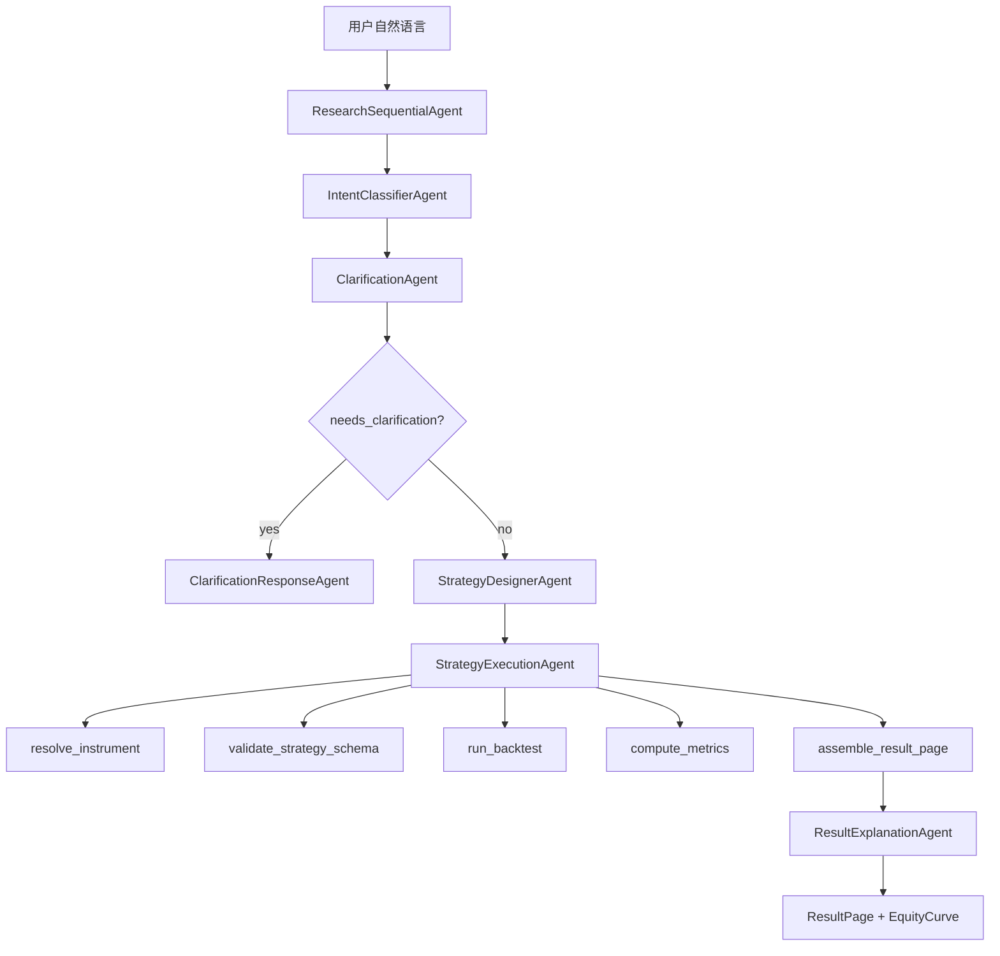

# ADK Orchestration Design v2

## 目标

Strategy Agent 的核心目标不是让 LLM 自由调用很多工具，而是让用户用自然语言表达投资想法后，系统稳定地产出：

- 是否需要澄清。
- 标准化策略结构。
- 可复现回测结果。
- 收益曲线、指标和风险解释。
- 清晰、短链路的执行轨迹。

因此 v2 架构要解决三个问题：

- 避免 root LLM 在工具之间反复试错。
- 保持“全流程 Agent 化”，但把执行顺序变得可控。
- 把量化回测知识沉淀成 skill 和脚本，让系统越用越稳。

## ADK 源码结论

### LlmAgent.planner

`LlmAgent` 的 `planner` 参数接受 `BasePlanner`。

ADK 内置两个 planner：

- `PlanReActPlanner`
- `BuiltInPlanner`

`PlanReActPlanner` 的源码逻辑是：

- 在 LLM request 中追加 planning instruction。
- 要求模型输出 `PLANNING / ACTION / REASONING / FINAL_ANSWER`。
- 在 response processor 中把 planning/reasoning 标记为 thought。
- 保留第一个或一组 function call。

它能提升单个 Agent 的思考质量，但不能保证流程只执行一次。工具调用权仍然在同一个 LLM 手里。

`BuiltInPlanner` 的源码逻辑是：

- 把 `thinking_config` 写入 `GenerateContentConfig`。
- 依赖模型/Provider 支持 built-in thinking。

当前模型是 DeepSeek API，不建议把主流程稳定性依赖在 `BuiltInPlanner` 上。

结论：`planner` 适合用于局部 Agent，不适合作为主流程编排器。

### SequentialAgent

`SequentialAgent` 的源码逻辑非常直接：

- 遍历 `sub_agents`。
- 逐个调用 `sub_agent.run_async(ctx)`。
- 当前 subagent 结束后才进入下一个。
- 如果 invocation pause，则停止后续 subagent。

这正好适合我们的主流程。

结论：主链路应该使用 `SequentialAgent` 编排。

### LoopAgent

`LoopAgent` 会循环执行 subagents，直到：

- 子 Agent 产生 `event.actions.escalate`。
- 达到 `max_iterations`。

它适合小范围修复，例如 schema repair 最多 2 次。不适合包住整个研究流程。

结论：只在局部修复阶段使用 LoopAgent，且必须设置 `max_iterations`。

### SkillToolset

`SkillToolset` 提供：

- `list_skills`
- `load_skill`
- `load_skill_resource`
- `run_skill_script`

源码中 `SkillToolset.process_llm_request` 会把 skill 列表和使用规则注入到 LLM request。

`run_skill_script` 需要配置 `BaseCodeExecutor`，会把 skill 里的 references/assets/scripts 打包成自包含代码后执行。

结论：SkillToolset 适合沉淀量化研究方法、schema 文档和 smoke scripts，不应该替代主流程编排。

### GkeCodeExecutor

`GkeCodeExecutor` 是 `BaseCodeExecutor` 的远端安全执行实现。

它支持：

- `executor_type="job"`：每次执行创建 Kubernetes Job。
- `executor_type="sandbox"`：使用 Agent Sandbox Client。

Job 模式会：

- 创建 ConfigMap 存放代码。
- 创建 GKE Job 执行 `python3 /app/code.py`。
- Pod 使用 gVisor runtime。
- 配置非 root、只读文件系统、禁止提权、CPU/内存限制。
- 使用 Watch 等待 Job 完成并读取 Pod log。

它适合执行不可信代码或云端批量任务，但当前本地数据回测不适合直接迁移到 GKE。

结论：GKE 作为未来执行后端预留，不进入 MVP 主链路。

## 推荐架构



## Agent 职责

### ResearchSequentialAgent

类型：`SequentialAgent`

职责：

- 固定运行顺序。
- 不直接调用业务工具。
- 不做自由推理。
- 只负责把子 Agent 串起来。

建议子 Agent 顺序：

1. `IntentClassifierAgent`
2. `ClarificationAgent`
3. `StrategyDesignerAgent`
4. `StrategyExecutionAgent`
5. `ResultExplanationAgent`

注意：如果 `ClarificationAgent` 判断需要澄清，后续 Agent 应该通过 callback 或 state gate 跳过。

### IntentClassifierAgent

类型：`LlmAgent`

建议 planner：无，或者轻量 `PlanReActPlanner`。

输入：

- 用户当前问题。
- session 中已有策略上下文。

输出：

- `intent_type`
- `is_backtest_request`
- `is_backtestable_now`
- `missing_fields`
- `inferred_fields`

约束：

- 不把默认日期、手续费、滑点、日线频率、币种当成 blocking missing field。
- 常见中文标的名交给工具解析，不向用户索要代码。

### ClarificationAgent

类型：`LlmAgent`

建议 planner：无。

输入：

- intent 输出。
- 用户问题。
- 当前 session state。

输出：

- `needs_clarification`
- `next_question`
- `must_ask_fields`
- `defaultable_fields`

约束：

- 最多问一个问题。
- 只问阻塞字段。
- 不问可默认字段。

### StrategyDesignerAgent

类型：`LlmAgent`

建议 planner：`PlanReActPlanner`

输入：

- 用户问题。
- intent 输出。
- clarification 输出。
- resolve instrument 结果。
- skill 中的 schema 说明。

输出：

- `StrategySchema`

约束：

- 只能输出当前引擎支持的 `strategy_type`。
- 单标的择时使用 `signal_trading`。
- 横截面轮动使用 `cross_sectional_rotation`。
- 不输出解释文本，只输出 schema JSON。

### StrategyExecutionAgent

类型：优先自定义 `BaseAgent`，也可以先用一个薄 service。

职责：

- 不调用 LLM。
- 按固定顺序执行工具。
- 把结果写入 ADK state。
- 产生可观测 timeline。

固定步骤：

1. `resolve_instrument`
2. `validate_strategy_schema`
3. `run_backtest`
4. `compute_metrics`
5. `assemble_result_page`
6. `store_artifact`

失败策略：

- schema 不合法：进入 schema repair。
- 数据缺失：返回明确错误。
- 回测失败：返回明确错误。
- 结果页没有收益曲线：不能标记 completed。

### SchemaRepairLoop

类型：`LoopAgent`

使用条件：

- StrategyDesignerAgent 产出 JSON，但 schema 校验失败。

限制：

- `max_iterations=2`
- 只修 schema，不重新理解用户问题。
- 每次修复必须基于 validation error。

### ResultExplanationAgent

类型：`LlmAgent`

建议 planner：`PlanReActPlanner`

输入：

- strategy schema
- backtest result
- metrics
- result page

输出：

- `summary_text`
- `risk_text`
- `limitations_text`
- `next_steps`

约束：

- 必须解释收益曲线。
- 必须解释最大回撤和交易次数。
- 不给投资建议。
- 不编造没有的数据。

## State 设计

建议统一 ADK state key：

- `intent.result`
- `clarification.result`
- `instrument.resolved`
- `strategy.schema`
- `strategy.validation`
- `backtest.result`
- `metrics.result`
- `report.result_page`
- `artifact.result`
- `workflow.status`
- `workflow.error`
- `trace.timeline`

状态流转：

```text
received
-> intent_classified
-> clarification_checked
-> needs_clarification | schema_designed
-> schema_validated
-> backtested
-> metrics_computed
-> report_assembled
-> explained
-> completed
```

## Timeline 设计

前端不应该展示所有底层事件。建议分两层：

用户可见 timeline：

- `识别意图`
- `检查是否需要补充`
- `生成策略结构`
- `校验策略`
- `读取行情数据`
- `执行回测`
- `计算指标`
- `生成结果页`
- `解释结果`

开发调试 timeline：

- ADK raw event
- subagent message
- function call args
- validation error
- token usage
- elapsed time

默认 UI 只展示用户可见 timeline。开发调试可以折叠展开。

## SkillToolset 设计

建议新增 skill：`quant_backtest_cn`

目录结构：

```text
skills/quant_backtest_cn/
  SKILL.md
  references/
    strategy_schema_v1.md
    default_assumptions.md
    supported_strategies.md
    data_contract.md
    risk_disclosure.md
  scripts/
    validate_schema.py
    run_backtest.py
    smoke_macd_510300.py
    smoke_rotation_top20.py
```

### SKILL.md 内容

必须说明：

- 当前支持的策略类型。
- 默认假设。
- 什么时候必须澄清。
- 什么时候不能澄清。
- StrategySchema 输出规范。
- 回测结果解释规范。
- 风险提示规范。

### references/strategy_schema_v1.md

必须说明：

- 字段定义。
- 合法枚举。
- 单标的择时样例。
- 横截面轮动样例。
- 常见错误示例。

### references/default_assumptions.md

建议默认值：

- `period.start`: project default。
- `period.end`: latest。
- `frequency`: 1d。
- `execution.buy_price`: next_open。
- `execution.sell_price`: next_open。
- `costs.commission_bps`: 3。
- `costs.slippage_bps`: 5。

### scripts/validate_schema.py

输入：

```bash
python validate_schema.py --schema-json '{"strategy_type":"signal_trading",...}'
```

输出：

```json
{
  "ok": true,
  "data": {
    "is_valid": true,
    "is_complete": true,
    "missing_fields": [],
    "warnings": []
  }
}
```

### scripts/run_backtest.py

输入：

```bash
python run_backtest.py --schema-file strategy.json --output-file result.json
```

输出：

```json
{
  "ok": true,
  "data": {
    "backtest": {},
    "metrics": {},
    "result_page": {}
  }
}
```

### scripts/smoke_macd_510300.py

目标：

- 一条命令跑通沪深300ETF MACD。
- 验证收益曲线存在。
- 验证状态为 completed。

### scripts/smoke_rotation_top20.py

目标：

- 一条命令跑通每月买入市值最大 20 只股票。
- 验证调仓、收益曲线、年度收益。

## ExecutionBackend 设计

为了预留未来扩展，建议定义执行后端概念。

```text
ExecutionBackend
  local
  container
  gke
```

### local

当前默认。

适合：

- MVP。
- 本地 parquet 数据。
- 快速调试。
- 单用户/小规模回测。

### container

未来开发环境可选。

适合：

- 隔离运行脚本。
- 测试 skill scripts。
- 更接近生产环境。

可使用 ADK `ContainerCodeExecutor`，但需要 Docker 和镜像。

### gke

未来生产可选。

适合：

- 用户自定义 Python 策略。
- 不可信代码隔离。
- 大规模参数搜索。
- 长时间批量回测。

可使用 ADK `GkeCodeExecutor`。

暂不进入 MVP 主链路，原因：

- 需要 GKE、RBAC、gVisor、镜像和数据挂载。
- 当前数据在本地 parquet。
- 冷启动和调试成本高。

## Planner 使用建议

推荐：

- `StrategyDesignerAgent`: 使用 `PlanReActPlanner`
- `ResultExplanationAgent`: 使用 `PlanReActPlanner`

不推荐：

- 主 root Agent 使用 planner。
- 把 planner 当流程控制器。
- 使用 BuiltInPlanner 依赖 DeepSeek thinking config。

原因：

- planner 改善单个模型回复。
- SequentialAgent 才控制流程顺序。
- 金融回测更需要确定性执行。

## 迁移计划

### Phase 1：文档和目录

- 新增本设计文档。
- 新增 skill 目录草案。
- 新增 scripts 契约文档。

### Phase 2：SequentialAgent 主链路

- 用 `ResearchSequentialAgent` 替换当前自由 root orchestrator。
- 保留现有 specialist agents。
- `StrategyExecutionAgent` 先用自定义 `BaseAgent` 或 runtime service 实现。

### Phase 3：State Gate

- `ClarificationAgent` 如果 needs clarification，则跳过后续执行 Agent。
- `StrategyExecutionAgent` 如果失败，则直接输出明确错误，不进入解释 Agent。
- completed 必须有收益曲线。

### Phase 4：SkillToolset

- 增加 `quant_backtest_cn` skill。
- 让 StrategyDesignerAgent 读取 schema/default assumptions。
- 增加 smoke scripts。

### Phase 5：执行后端抽象

- 抽象 `ExecutionBackend`。
- 默认 local。
- 预留 container/gke 配置。

## 验收标准

### 用户体验

- 一个常见 MACD 问题不需要澄清日期、手续费、滑点。
- 用户可以看到短链路 timeline。
- timeline 不出现重复策略设计和重复回测。
- 结果页必须包含收益曲线。

### 技术稳定性

- 同一轮最多一次主策略设计。
- 同一轮最多一次主回测。
- schema repair 最多 2 次。
- unsupported strategy type 在 schema 层被拒绝。
- 工具返回结构必须被 collector 正确解析。

### 可测试性

- `smoke_macd_510300.py` 一条命令通过。
- `smoke_rotation_top20.py` 一条命令通过。
- API `/research/stream` 能完成并返回 `completed`。
- 前端能展示 result page 和 equity curve。

## 当前结论

最佳路线：

```text
SequentialAgent 主编排
+ 小型 LlmAgent
+ 局部 PlanReActPlanner
+ SkillToolset 知识和脚本
+ local execution backend
+ 未来预留 GkeCodeExecutor
```

不要继续强化“一个 root LLM 拿所有工具自由执行”的模式。它灵活，但不适合金融回测产品的稳定性要求。
