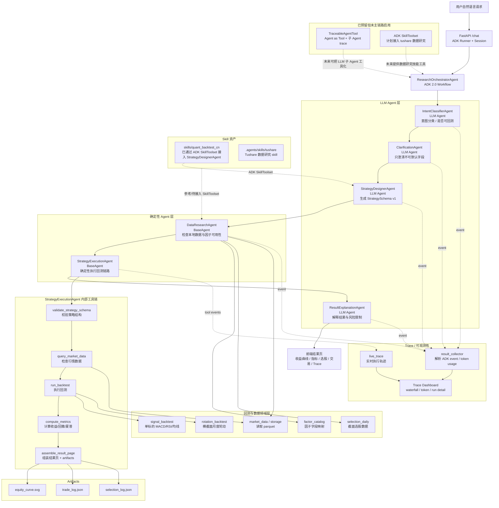

# Agent 编排流程

这张图描述当前 TradeX / Strategy Agent 的主链路：用户用自然语言提出策略想法，系统通过 ADK 2.0 `Workflow` 编排多个 Agent，最终完成策略结构化、数据检查、回测执行、结果解释和 Trace 展示。

## 当前说明

- 主编排方式是 ADK 2.0 `Workflow`，不是手写 if/else 流程。
- LLM Agent 负责理解、澄清、结构化和解释；确定性 Agent 负责数据检查和回测执行。
- `StrategyExecutionAgent` 内部工具链是稳定执行路径，避免让模型直接生成或运行任意代码。
- `skills/quant_backtest_cn` 已作为 ADK `SkillToolset` 接入 `StrategyDesignerAgent`。
- `.agents/skills/tushare` 当前仍作为数据研究 skill 资产，后续可接入数据补齐链路。
- `TraceableAgentTool` 已预留，用于未来把子 Agent 工具化并透传更细粒度 Trace。
