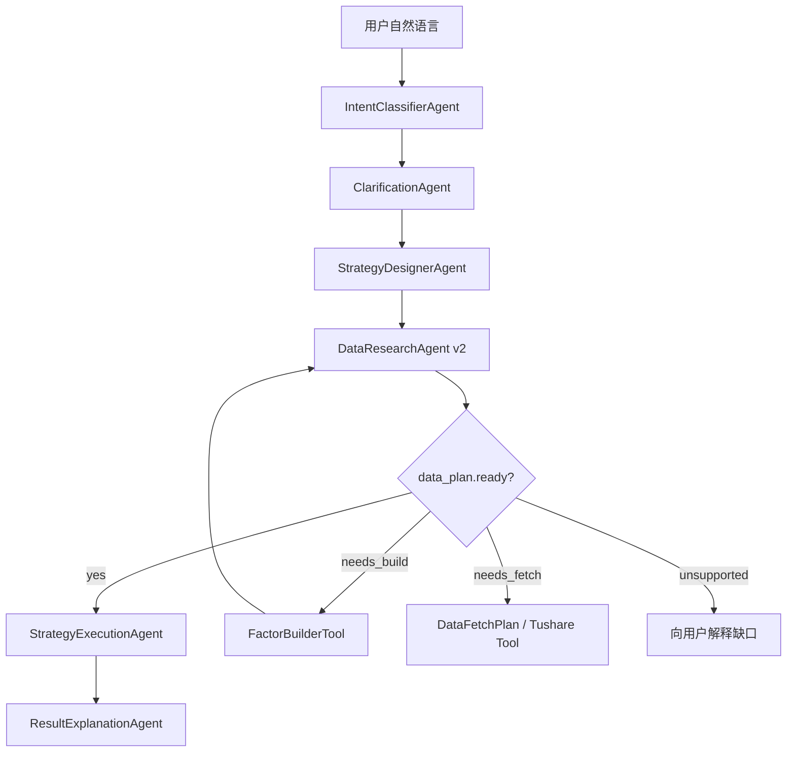

# DataResearchAgent Design v2

## 核心定位

`DataResearchAgent` v2 不再只是“数据是否存在”的检查器，而是策略回测前的“数据与因子研究中枢”。

它负责把 `StrategyDesignerAgent` 产出的策略结构，进一步转成可执行的数据计划：

- 识别策略需要哪些行情、财务、截面、派生因子。
- 对齐本地数据字典和因子目录。
- 判断因子是已存在、可派生、需要补数，还是暂不支持。
- 对可派生因子生成构建计划并触发确定性工具。
- 只有在数据和因子都 ready 时，才允许进入回测。

一句话：`StrategyDesignerAgent` 负责“用户想做什么”，`DataResearchAgent` 负责“这些想法需要哪些数据才能严谨地做”。

## 为什么需要它

自然语言里大量策略条件不是数据库原始字段：

- “上个月涨幅最大”不是原始字段，但可由前复权日线计算 `monthly_return`。
- “20日新高”不是原始字段，但可由 `close/high` 计算 `high_20_breakout`。
- “放量突破”通常需要 `volume_ratio_20`。
- “低估值”可能映射到 `pe_ttm`、`pb`、`ps_ttm`。
- “业绩增长”可能需要财报字段，如果本地没有就要补数。

如果没有这个 Agent，系统会在两种坏体验之间摇摆：

- 太严格：字段不存在就 blocked，用户明明给了合理策略却跑不下去。
- 太松：模型编字段、编结果，回测不可复现。

v2 的目标是在两者之间建立一条清晰路线：先查目录，再派生，再补数，最后才回测。

## ADK 编排位置



主链路仍使用 `SequentialAgent`。`DataResearchAgent` 自身可以是自定义 `BaseAgent`，内部调用确定性工具；需要语义判断时，再用一个小型 `LlmAgent` 作为“FactorIntentAgent”。

## 输入

v2 的输入来自 ADK session state 和当前 invocation events：

- `user.query`：用户原始问题。
- `intent`：是否回测、策略类型、默认假设。
- `clarification`：是否还需澄清。
- `strategy_schema`：标准策略结构。
- `data.catalog`：本地数据集字段目录。
- `factor.catalog`：已有和可派生因子目录。

原则：不要让 `DataResearchAgent` 自由改写策略逻辑。它可以规范化字段和因子，但不能把“涨幅最大”改成“成交额最大”。

## 输出

建议将现有 `DataAvailabilityReport` 升级为 `DataResearchReport`。

```json
{
  "is_required": true,
  "is_ready": true,
  "can_continue_backtest": true,
  "blocking_issues": [],
  "warnings": ["period.start_or_end_uses_local_default"],
  "required_factors": [
    {
      "name": "monthly_return",
      "display_name": "上个月涨幅",
      "status": "ready",
      "source_type": "derived",
      "dataset": "selection_factor",
      "base_datasets": ["daily_qfq"],
      "base_fields": ["trade_date", "close"],
      "compute_method": "previous_month_close_return",
      "lookback": "previous_month"
    }
  ],
  "required_datasets": [],
  "local_coverage": [],
  "factor_build_plan": [],
  "fetch_plan": [],
  "schema_patch": {
    "selection.ranking.sort_by": "monthly_return",
    "selection.ranking.lookback": "previous_month_return"
  },
  "rationale": "上个月涨幅可由本地前复权日线派生，已准备好进入回测。"
}
```

关键字段：

- `required_factors`：策略真正需要的因子。
- `source_type`：`raw_field`、`derived`、`external_fetch`、`unsupported`。
- `factor_build_plan`：可派生但尚未落盘时的构建计划。
- `fetch_plan`：本地无法派生、需要 Tushare 或其他数据源时的补数计划。
- `schema_patch`：把模型不稳定字段规范化，例如 `last_month_return -> monthly_return`。
- `can_continue_backtest`：执行 Agent 的唯一 gate。

## 因子目录

先做一个轻量 `factor_catalog.py`，不要上复杂数据库。

每个因子定义包含：

```python
{
    "name": "monthly_return",
    "aliases": ["上个月涨幅", "上月收益", "last_month_return"],
    "source_type": "derived",
    "base_datasets": ["daily_qfq"],
    "base_fields": ["trade_date", "close"],
    "compute_method": "previous_month_close_return",
    "builder": "build_monthly_return_factor",
    "supported_strategy_types": ["cross_sectional_rotation"],
}
```

第一阶段建议覆盖 20 个常见因子：

- `amount`：成交额，原始字段。
- `vol`：成交量，原始字段。
- `total_mv`：总市值，原始字段。
- `circ_mv`：流通市值，原始字段。
- `turnover_rate`：换手率，原始字段。
- `pe_ttm`：滚动市盈率，原始字段。
- `pb`：市净率，原始字段。
- `monthly_return`：上月涨幅，派生。
- `return_5d`：近 5 日收益，派生。
- `return_20d`：近 20 日收益，派生。
- `return_60d`：近 60 日收益，派生。
- `volatility_20d`：20 日波动率，派生。
- `ma_20`：20 日均线，派生。
- `ma_60`：60 日均线，派生。
- `ma_distance_20`：价格相对 20 日均线偏离，派生。
- `volume_ratio_20d`：20 日量比，派生。
- `high_20_breakout`：20 日新高突破，派生。
- `low_20_breakdown`：20 日新低，派生。
- `drawdown_60d`：近 60 日最大回撤，派生。
- `reversal_20d`：20 日反转因子，派生。

## 数据决策流程

```text
1. 从 StrategySchema 提取数据需求
2. 从自然语言和 schema 字段识别 factor intent
3. 用 factor_catalog 规范化字段名
4. 对每个因子判断：
   - raw_field：检查本地字段是否存在
   - derived：检查基础字段是否存在；不存在则补基础数据；存在则构建派生因子
   - external_fetch：生成补数计划
   - unsupported：阻塞并解释
5. 如果产生 schema_patch，写入 ADK state
6. 如果 factor_build_plan 可执行，调用确定性工具构建
7. 重新检查 coverage
8. ready 后进入 StrategyExecutionAgent
```

## 工具设计

`DataResearchAgent` 不应该自己读写大量数据，应调用工具。

第一阶段工具：

- `inspect_data_catalog()`：返回本地数据集和字段目录。
- `resolve_factor_requirements(strategy_schema, user_query)`：输出候选因子。
- `match_factor_catalog(factor_name)`：别名匹配和规范化。
- `inspect_factor_coverage(factor)`：检查因子是否 ready。
- `build_factor(factor_build_plan)`：构建可派生因子。
- `plan_data_fetch(missing_factor)`：生成补数计划。

其中 `build_factor` 必须是确定性工具，不交给 LLM 写代码执行。

## State 设计

建议新增 ADK state key：

- `data.research_report`
- `data.required_factors`
- `data.factor_build_plan`
- `data.fetch_plan`
- `data.schema_patch`
- `data.catalog_snapshot`
- `workflow.data_ready`

`StrategyExecutionAgent` 只读：

```python
workflow.data_ready is True
```

不要让执行 Agent 重新判断因子是否可用。

## 与 StrategyDesignerAgent 的边界

`StrategyDesignerAgent` 可以写出较接近自然语言的字段，例如：

```json
{"sort_by": "last_month_return"}
```

但它最好被 prompt 约束到常见字段。

`DataResearchAgent` 负责最终规范化：

```json
{"sort_by": "monthly_return", "lookback": "previous_month_return"}
```

这能降低对模型一次性完美输出的依赖。

## 与补数功能的关系

v2 先支持“可派生因子自动构建”，暂不自动联网补数。

如果需要外部数据，先返回：

- 缺什么。
- 为什么本地推不出来。
- 推荐 Tushare 接口。
- 目标落盘路径。
- 用户确认后再补数。

这样可以避免 Tushare 配额被 Agent 不透明地消耗。

## 最小落地版本

第一步只做 4 件事：

1. 新增 `FactorSpec` / `DataResearchReport` schema。
2. 新增 `factor_catalog.py`，覆盖 20 个常见因子。
3. 将现有 `inspect_strategy_data` 拆成：
   - `infer_required_factors`
   - `inspect_factor_coverage`
   - `build_ready_derived_factors`
   - `assemble_data_research_report`
4. 让 `DataResearchAgent` 输出 v2 report，并把 `can_continue_backtest` 接入执行 gate。

第二步再做：

- Trace 页面展示“因子识别 / 因子构建 / 数据覆盖”。
- 为慢因子增加缓存和批量构建。
- 增加 Tushare fetch plan，但不默认自动拉取。

## 验收用例

必须覆盖：

- “每月买入上个月涨幅最大的 5 只股票”：映射 `monthly_return`，可派生，继续回测。
- “每月买入成交额最大的 20 只股票”：映射 `amount`，原始字段，继续回测。
- “买入市值最大的 20 只股票”：映射 `total_mv`，原始字段，继续回测。
- “20 日新高突破”：映射 `high_20_breakout`，可派生，继续回测。
- “低 PE 低 PB 组合”：映射 `pe_ttm`、`pb`，原始字段，继续回测或给出字段缺口。
- “北向资金连续流入”：如果本地无资金流数据，生成 fetch plan，不编结果。

## 设计原则

- 不因字段不存在就直接 blocked，先判断能否派生。
- 不让 LLM 发明数据字段，必须经过 factor catalog。
- 不让执行 Agent 承担数据研究职责。
- 能本地派生的先本地派生，不能派生的再补数。
- 所有数据口径必须进入 Trace 和结果解释。
